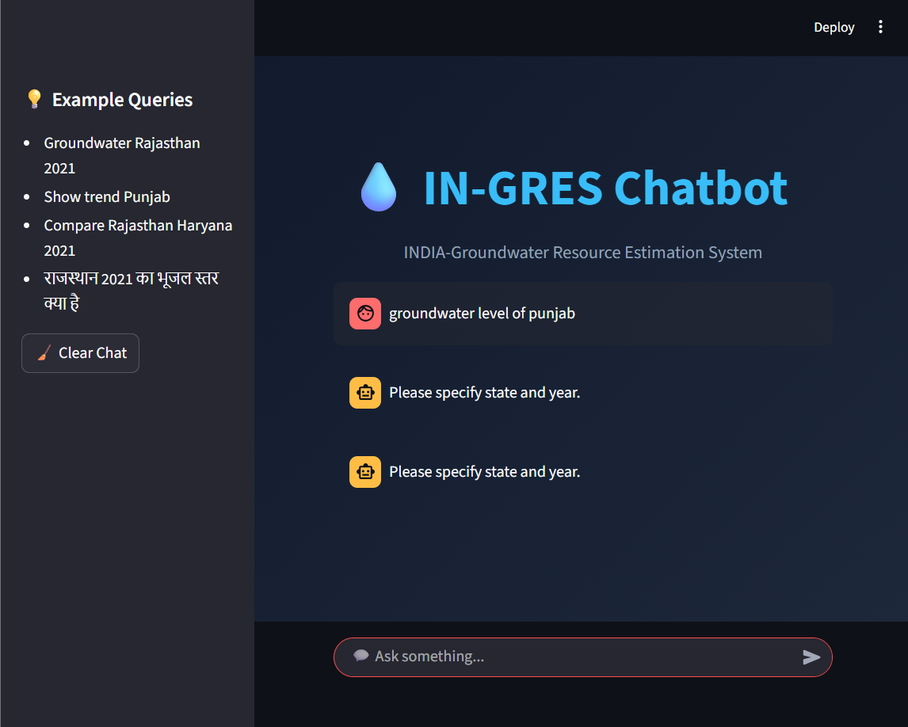

# 💧 INDIA-Groundwater Resource Estimation System (IN-GRES)


🚀 **An AI-powered chatbot for analyzing groundwater data across India using natural language queries.**


## ✨ Features

* 💬 Chat-based interface (like ChatGPT)
* 🌐 Supports **English + Hindi queries**
* 📊 Trend analysis with interactive charts
* 📈 State comparison visualization
* 🧠 Context-aware responses (remembers previous queries)
* 📊 Toggle-based chart viewing (open/close charts per query)

## 🛠️ Tech Stack

* **Frontend:** Streamlit
* **Backend Logic:** Python
* **Data Processing:** Pandas
* **Visualization:** Matplotlib
* **Translation:** Deep Translator

---

## 📂 Dataset

Groundwater data for Indian states (2015–2025)

```
state | year | groundwater_level
```

---

## 🧠 How It Works

1. User enters a query (English or Hindi)
2. System detects:

   * State
   * Year
   * Intent (trend / comparison / value)
3. Data is fetched from dataset
4. Results are displayed with charts and insights

---

## ▶️ Run Locally

```bash
pip install -r requirements.txt
streamlit run app.py
```

---

## 💡 Example Queries

* Groundwater Rajasthan 2021
* Show trend Punjab
* Compare Rajasthan Haryana 2021
* राजस्थान 2021 का भूजल स्तर क्या है

---

## 📸 Screenshots

👉 Add your app screenshot here (very important)

Example:

```

```


## 🚀 Future Improvements

* 🌍 Real-time API integration (INGRES database)
* 🎤 Voice-based interaction
* 🤖 Advanced NLP models


## 🎯 Project Highlights

* End-to-end AI chatbot system
* Real-world application (water resource analysis)
* Clean UI with interactive charts

